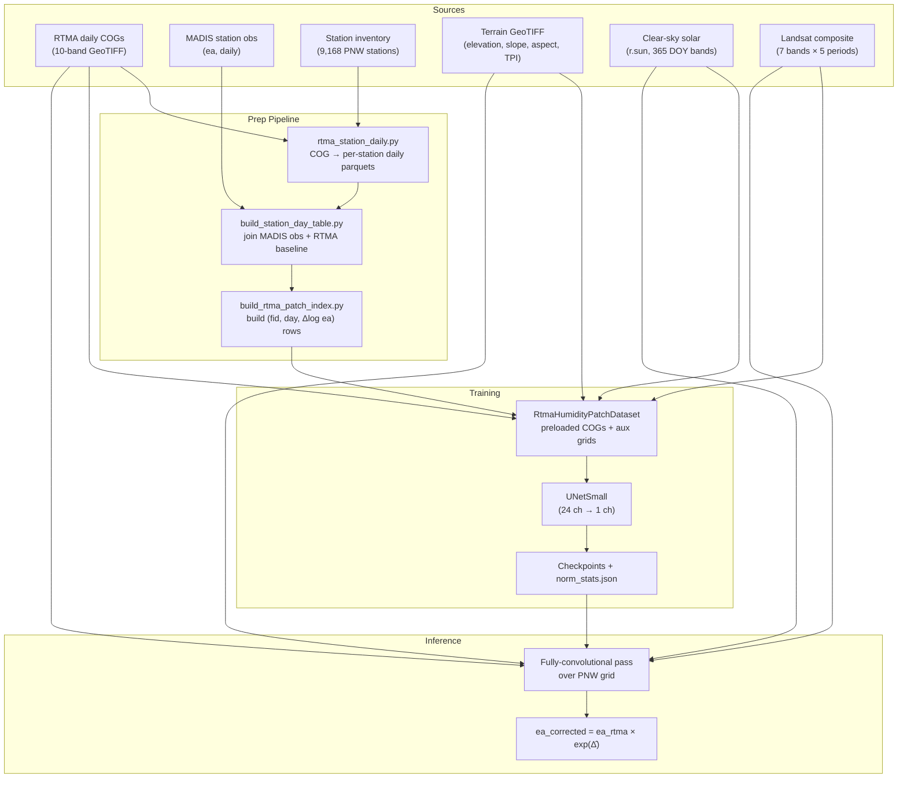

# System Architecture

## Product Definition

The MVP produces a corrected daily vapor pressure field by applying a learned multiplicative bias-correction to RTMA:

$$
e_{a,\text{corrected}}(x, \text{day}) = e_{a,\text{rtma}}(x, \text{day}) \cdot \exp\!\bigl(\widehat{\Delta\!\log e_a}(x, \text{day})\bigr)
$$

| Symbol | Description |
|--------|-------------|
| $e_{a,\text{rtma}}$ | RTMA baseline vapor pressure, derived from dewpoint via the Magnus formula |
| $\widehat{\Delta\!\log e_a}$ | Predicted log-space correction from the U-Net |
| $e_{a,\text{corrected}}$ | Final output -- corrected vapor pressure (kPa) |

The correction is learned in log-space so the model output is additive in $\log e_a$ but multiplicative in $e_a$, which stabilizes variance across dry and wet regimes.

---

## Pipeline Overview



---

## Artifact Inventory

| Artifact | Format | Purpose | Build Script |
|----------|--------|---------|-------------|
| Per-station daily RTMA parquets | Parquet (one per station) | RTMA values at station locations | `grid/sources/rtma_station_daily.py` |
| Station-day table | Parquet (fid × day) | Joined MADIS obs + RTMA baseline + residuals | `prep/build_station_day_table.py` |
| Patch index | Parquet (fid, day, $\Delta\!\log e_a$, lat, lon) | Training sample roster after outlier filtering | `prep/build_rtma_patch_index.py` |
| `norm_stats.json` | JSON | Per-channel mean/std for input normalization | Computed during dataset init |
| Model checkpoints | `.ckpt` (Lightning) | Top-5 by val_loss + last epoch | `train_patch_unet.py` via Lightning |
| Experiment registry | JSONL | Config hash + final metrics per run | `experiment.py:log_experiment()` |
| TOML configs | `.toml` | Reproducible experiment definitions | `configs/` directory |

---

## U-Net Architecture

`UNetSmall` is a minimal 2-level encoder-decoder with skip connections:

```
Input (B, C_in, 64, 64)
  │
  ├─ down1: ConvBlock(C_in → base)          ── skip₁ (B, base, 64, 64)
  ├─ MaxPool2d(2)
  ├─ down2: ConvBlock(base → 2·base)        ── skip₂ (B, 2·base, 32, 32)
  ├─ MaxPool2d(2)
  │
  ├─ mid: ConvBlock(2·base → 4·base)        (B, 4·base, 16, 16)
  │
  ├─ ConvTranspose2d(4·base → 2·base, k=2, s=2)
  ├─ cat(↑, skip₂) → (B, 4·base, 32, 32)
  ├─ dec2: ConvBlock(4·base → 2·base)
  │
  ├─ ConvTranspose2d(2·base → base, k=2, s=2)
  ├─ cat(↑, skip₁) → (B, 2·base, 64, 64)
  ├─ dec1: ConvBlock(2·base → base)
  │
  └─ Conv2d(base → 1, k=1)                  (B, 1, 64, 64)
```

Each `ConvBlock` is `Conv2d(3×3, pad=1) → ReLU → Conv2d(3×3, pad=1) → ReLU`.

| Configuration | base | Parameters | Use |
|---------------|------|-----------|-----|
| MVP default | 32 | ~120K | Fast iteration (Runs 1--3) |
| Maximum-effort | 48 | ~270K | Run 5 (7-year training) |

---

## TOML Config System

Experiments are defined as `ExperimentConfig` dataclasses that serialize to TOML for reproducibility. Feature selection uses a group system:

```toml
# configs/run5_all_features.toml
name = "run5_all_features"
description = "Maximum-effort: 7 years, base-48, all features"
features = ["rtma_all", "terrain", "rsun", "landsat"]
base = 48
lr = 0.0003
tv_weight = 0.001
batch_size = 128
epochs = 100
patch_size = 64
val_frac = 0.2
seed = 42
target_col = "delta_log_ea"
start_date = "2018-01-01"
end_date = "2024-12-31"
```

Feature groups expand at runtime into individual channel names:

| Group | Channels | Count |
|-------|----------|-------|
| `rtma_all` | tmp_c, dpt_c, ugrd, vgrd, pres_kpa, tcdc_pct, prcp_mm, ea_kpa | 8 |
| `terrain` | elevation, slope, aspect_sin, aspect_cos, tpi_4, tpi_10 | 6 |
| `rsun` | rsun | 1 |
| `landsat` | ls_b2, ls_b3, ls_b4, ls_b5, ls_b6, ls_b7, ls_b10 | 7 |

DOY encodings (doy_sin, doy_cos) are always appended, bringing the default total to **24 channels**.

Each config produces a deterministic SHA-256 hash for deduplication and naming. Final metrics are appended to an `experiment_registry.jsonl` file for tracking across runs.

---

## Contrast with Full DADS

| Aspect | Full DADS | MVP |
|--------|-----------|-----|
| Spatial model | GNN (TransformerConv) on star graphs | 2-level U-Net on 64×64 patches |
| Identity signal | 64-dim autoencoder embedding per station | None (no station identity needed) |
| Background surface | Station-derived harmonic climatology $B(x, \text{doy})$ | RTMA itself (bias-correction framing) |
| Data stores | zarr (stations, cube, graph, cell_station_index) | Parquet index + raw GeoTIFFs |
| Training inputs | Station sequences (120-day windows) | Gridded patches (single day) |
| Temporal context | 12-day TCN per neighbor | Single-day snapshot + DOY encoding |
| Target | Anomaly $A = \text{obs} - B$ | $\Delta\!\log e_a = \log(e_{a,\text{obs}}) - \log(e_{a,\text{rtma}})$ |
| Inference | Tile-based star-graph batching | Fully convolutional pass over domain |

The MVP validates terrain-aware spatial correction of RTMA humidity without the infrastructure cost of the full pipeline. Lessons learned here (feature importance, normalization, preloading) feed directly into the production system.
