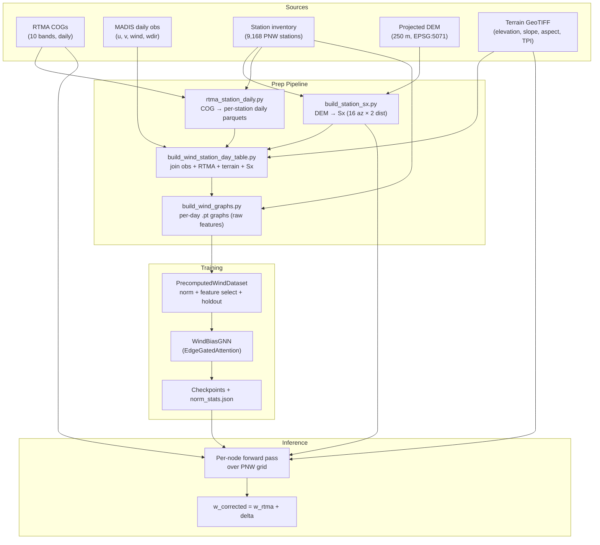

# System Architecture

---

## Product Definition

The model predicts an additive vector correction to the RTMA wind field:

$$
\mathbf{w}_\text{corrected} = \mathbf{w}_\text{rtma} + \hat{\delta}_{par} \cdot \hat{e}_{par} + \hat{\delta}_{perp} \cdot \hat{e}_{perp}
$$

| Symbol | Meaning |
|--------|---------|
| $\mathbf{w}_\text{rtma}$ | RTMA wind vector $(u, v)$ at a station or grid cell |
| $\hat{e}_{par}$ | Unit vector parallel to RTMA wind direction: $(u, v) / \|\mathbf{w}\|$ |
| $\hat{e}_{perp}$ | Unit vector perpendicular to RTMA wind: $(-v, u) / \|\mathbf{w}\|$ |
| $\hat{\delta}_{par}$ | Predicted speed bias (positive = obs faster than RTMA) |
| $\hat{\delta}_{perp}$ | Predicted directional bias (cross-wind component of error) |

The parallel/perpendicular decomposition decouples speed error from direction error, making each component independently interpretable and allowing component-specific analysis.

---

## Pipeline Overview



---

## Artifact Inventory

| Artifact | Format | Purpose | Build Script |
|----------|--------|---------|-------------|
| Per-station daily RTMA parquets | Parquet (one per station) | RTMA values at station locations | `process/gridded/rtma_station_daily.py` |
| Sx parquet | Parquet (9,168 rows, 36 cols) | Winstral Sx + derived terrain openness | `prep/build_station_sx.py` |
| Station-day wind table | Parquet (fid x day, ~5M rows) | Joined obs + RTMA + terrain + Sx + targets | `prep/build_wind_station_day_table.py` |
| Precomputed graphs dir | `.pt` files (one per day, ~3.7 GB) | Raw features + edges for all stations | `prep/build_wind_graphs.py` |
| `meta.json` | JSON | Feature columns, edge dim, graph params | `build_wind_graphs.py` |
| `norm_stats.json` | JSON | Per-feature mean/std for z-score | Computed at training init |
| `holdout_fids.json` | JSON | Elevation-stratified holdout station IDs | `train_wind_gnn.py` |
| Model checkpoints | `.ckpt` (Lightning) | Top-3 by val_loss | `train_wind_gnn.py` via Lightning |
| Experiment registry | JSONL | Config + final metrics per run | `train_wind_gnn.py` |
| TOML configs | `.toml` | Reproducible experiment definitions | `configs/wind_*.toml` |

---

## GNN Architecture

`WindBiasGNN` (`models/wind_bias/gnn.py`) implements edge-gated neighbor attention:

```
Input: x_i (node features, dim=node_dim)
  │
  ├─ Node encoder: MLP(node_dim → hidden_dim → hidden_dim), 2-layer ReLU
  │  h_i = encode(x_i)
  │
  ├─ Save h_local = h_i  (for skip connection)
  │
  ├─ Hop 1: EdgeGatedAttention
  │    α_ji = softmax_j( MLP_att([h_i; h_j; e_ji]) )    — scalar attention
  │    c_i  = Σ_j α_ji · h_j                             — weighted aggregation
  │    h_i  = MLP_merge([h_i; c_i])                       — context merge
  │
  ├─ [Optional] Hop 2: repeat with updated h
  │
  └─ Output head: MLP([h_local; h_final] → 2)
     → (delta_w_par, delta_w_perp)
```

In MLP mode (`use_graph=False`), attention is skipped and the output head takes `h` directly from the node encoder:

```
h = node_encoder(x)  →  output_head(h)  →  (delta_w_par, delta_w_perp)
```

| Component | Details |
|-----------|---------|
| `EdgeGatedAttention` | `MessagePassing(aggr="add")`, attention MLP: `2*hidden + edge_dim → hidden → 1` |
| Node encoder | `Linear(node_dim, hidden) → ReLU → Linear(hidden, hidden) → ReLU` |
| Merge layers | `Linear(2*hidden, hidden) → ReLU` (one per hop) |
| Output head | `Linear(2*hidden, hidden) → ReLU → Linear(hidden, 2)` (GNN) or `Linear(hidden, hidden) → ReLU → Linear(hidden, 2)` (MLP) |

---

## TOML Config System

Experiments are defined via `WindGNNConfig` dataclasses that serialize to TOML. Feature selection uses boolean flags:

```toml
# configs/wind_gnn_full.toml
name = "wind_gnn_full"
description = "Step 3: Full GNN with Sx + flow-terrain features"

# Model
hidden_dim = 128
n_hops = 1
use_graph = true
use_sx = true
use_flow_terrain = true

# Training
lr = 1e-3
weight_decay = 1e-5
huber_delta = 2.0
calm_threshold = 2.0
calm_min_weight = 0.1
batch_size = 16
epochs = 100
seed = 42
k_neighbors = 16

# Data
table_path = "/nas/dads/mvp/station_day_wind_pnw_2018_2024.parquet"
stations_csv = "artifacts/madis_pnw.csv"
out_dir = "/nas/dads/mvp/wind_gnn_full"
graph_dir = "/nas/dads/mvp/wind_graphs_pnw"
train_years = [2018, 2019, 2020, 2021, 2022, 2023]
val_years = [2024]
```

| Flag | Effect on features |
|------|-------------------|
| `use_graph` | `true`: build edges, run attention. `false`: MLP-only (no edges) |
| `use_sx` | `true`: include 32 Sx columns + 2 derived. `false`: exclude them |
| `use_flow_terrain` | `true`: include `flow_upslope`, `flow_cross`, `wind_aligned_sx`. `false`: exclude |

CLI overrides are supported for all config fields (e.g. `--hidden-dim 256 --epochs 50`).

---

## Contrast with Humidity MVP

| Aspect | Humidity MVP | Wind MVP |
|--------|-------------|----------|
| Spatial model | Gridded 2-level U-Net (64x64 patches) | Station-graph GNN (EdgeGatedAttention) |
| Graph | None (pixel grid) | k-NN (k=16, 150 km radius) |
| Target dimension | 1 (scalar $\Delta\!\log e_a$) | 2 (vector: $\delta_{par}$, $\delta_{perp}$) |
| Supervision | Center-pixel (one station per patch) | Per-node (all stations per day) |
| Loss | Huber + TV regularization | Huber + calm-wind weighting |
| Inference | Fully convolutional pass over domain | Per-node prediction (grid cells as nodes) |
